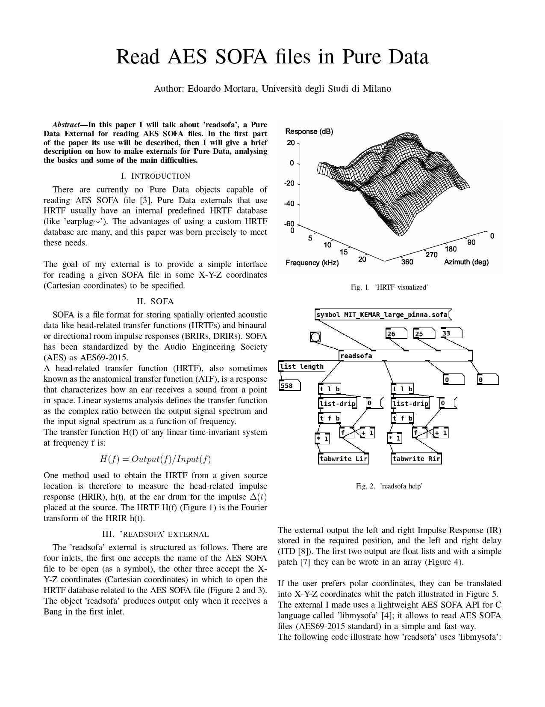
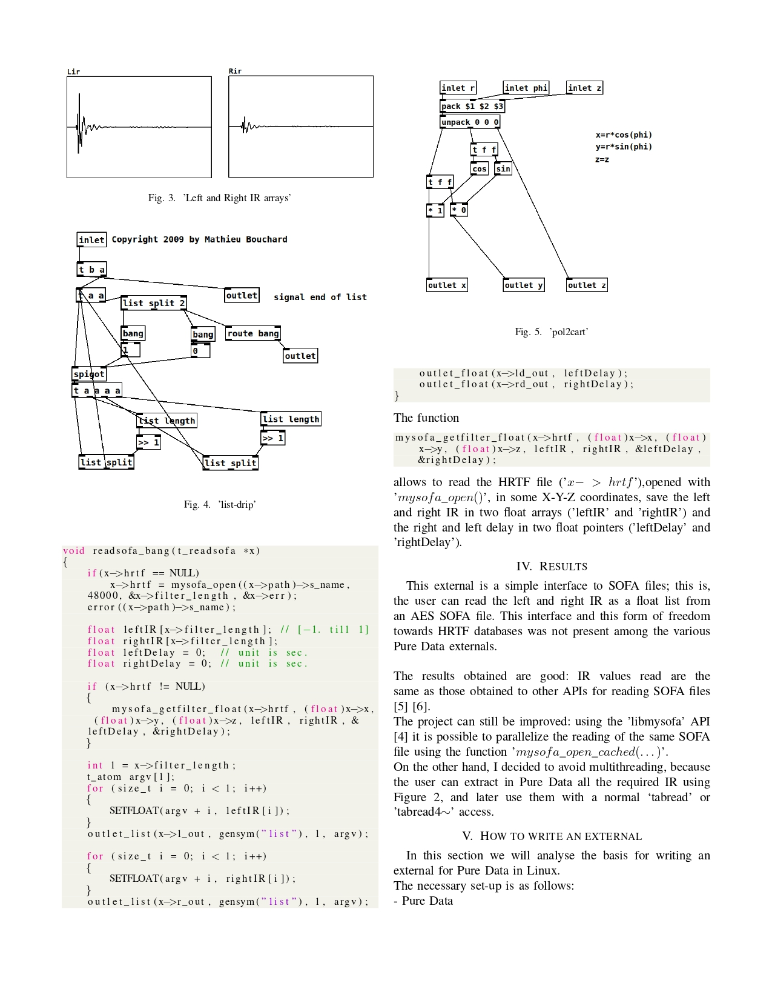
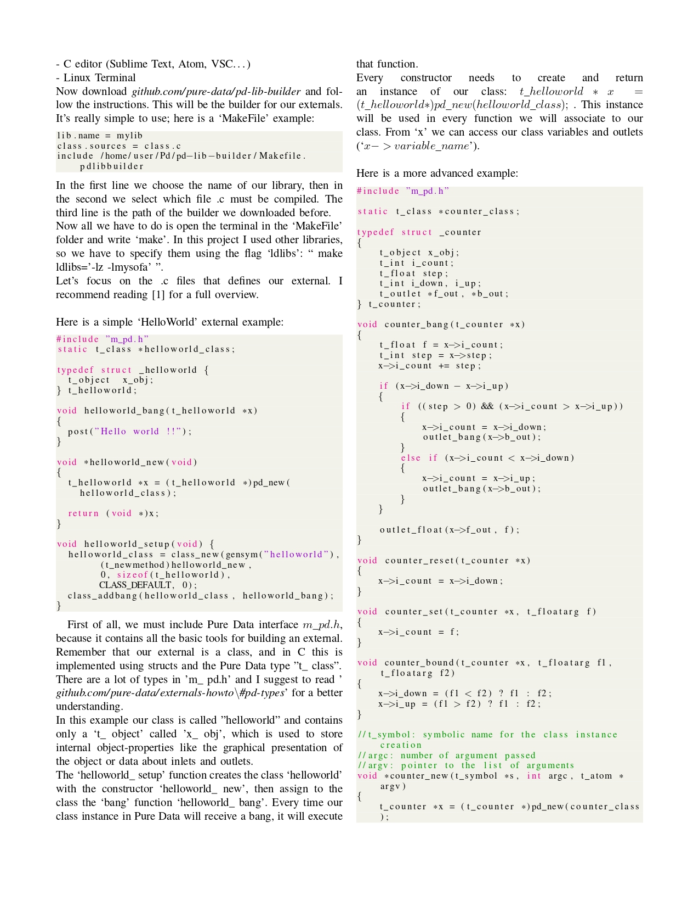
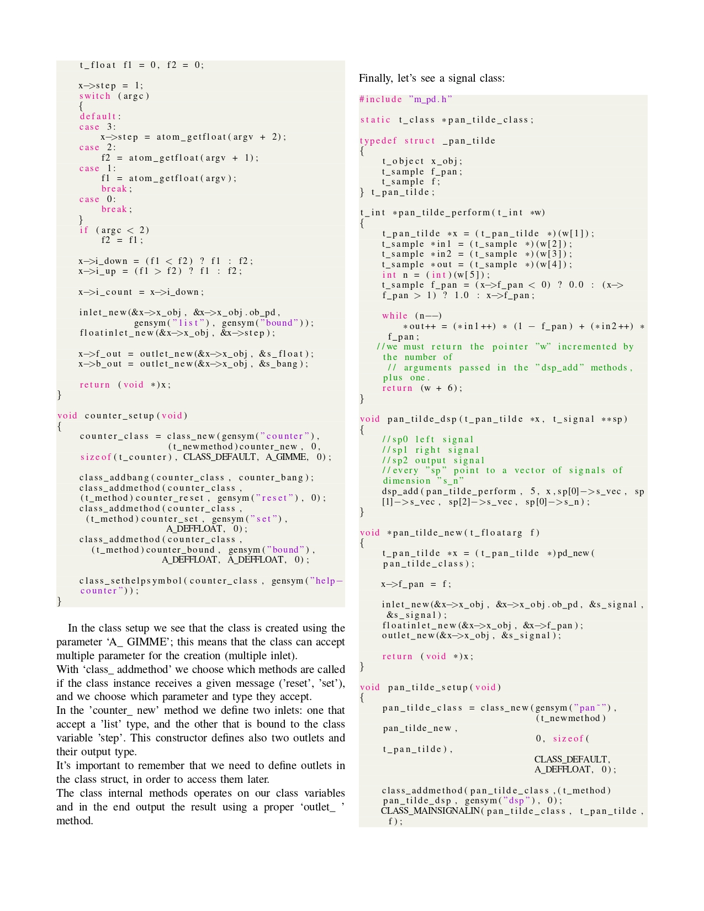
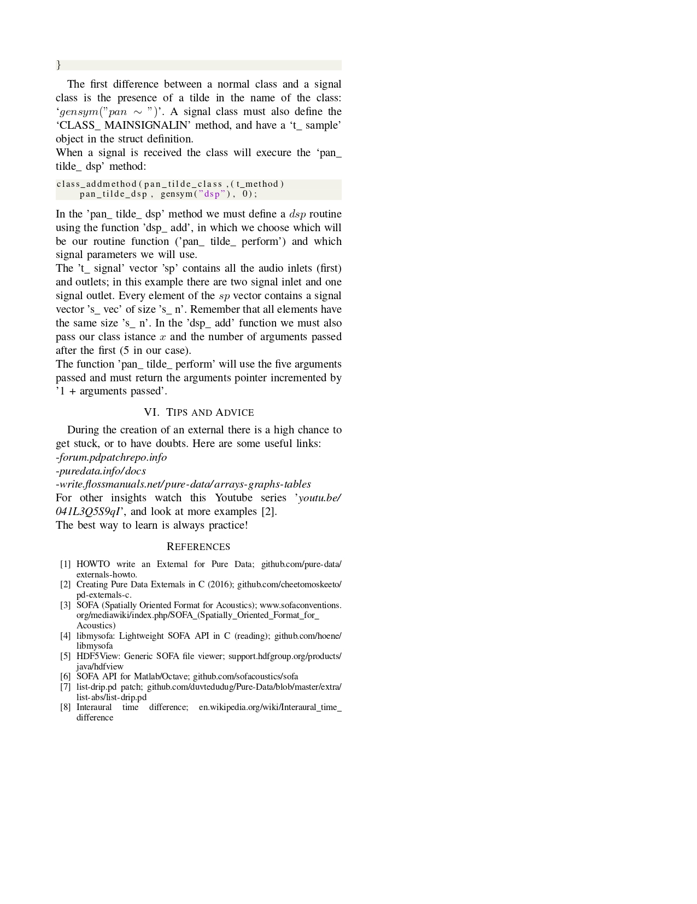

# Read AES SOFA files in Pure Data

## Author: Edoardo Mortara, Universita' degli Studi di Milano

## Abstract

In this paper I will talk about ’readsofa’, a Pure
Data External for reading AES SOFA files. In the first part
of the paper its use will be described, then I will give a brief
description on how to make externals for Pure Data, analysing
the basics and some of the main difficulties.

